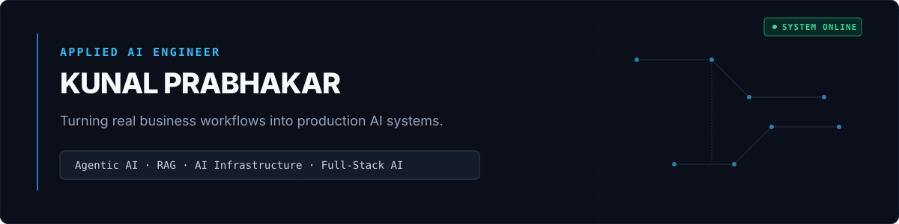

  <a href="https://kunal3369.github.io/kunal-portfolio">Portfolio</a> &nbsp;·&nbsp;
  <a href="https://linkedin.com/in/prabhakarkunal">LinkedIn</a> &nbsp;·&nbsp;
  <a href="mailto:kunal.prabhakar3082@gmail.com">Email</a>

  
  
  

  <strong>Applied AI Engineer building production AI systems that transform real business workflows into intelligent software—from requirements gathering to deployment.</strong>

---

## 01 / BUILDING

### AgentForge AI
**Agent Orchestration Platform** &nbsp;|&nbsp; `IN ACTIVE DEVELOPMENT`

Stateful orchestration for multi-step AI agent workflows with LangGraph, MCP, RAG, human approval gates, persistent execution state, and multi-model execution. Currently focused on reliability, evaluation, and production readiness.

`LangGraph` · `MCP` · `FastAPI` · `PostgreSQL`

---

### AIGateway
**Multi-Provider AI Gateway & Control Plane** &nbsp;|&nbsp; `IN ACTIVE DEVELOPMENT` &nbsp;|&nbsp; [<kbd>GitHub</kbd>](https://github.com/KUNAL3369/AI-Gateway)

AI infrastructure for multi-provider routing, failover, circuit breaking, authentication, observability, and deployment. Building an OpenAI-compatible control plane for production LLM applications.

`FastAPI` · `Docker` · `Kubernetes` · `OpenTelemetry`

---

## 02 / SHIPPED

| Project | Description | Stack | Links |
| :--- | :--- | :--- | :--- |
| **JobHunt AI** | Autonomous job search agent with browser automation, ATS scoring, structured LLM outputs, and tailored application generation.  *Submitted to TinyFish $2M Pre-Accelerator Hackathon 2026* | `React 18` · `TypeScript` · `Redux` · `Groq/LLaMA 3.1` | [Live](https://jobhunt-ai-ochre.vercel.app) · [GitHub](https://github.com/KUNAL3369/Jobhunt-AI) |
| **AI Research Assistant** | RAG document Q&A with pgvector retrieval and chunk-level citations. | `Next.js` · `OpenAI/Groq` · `pgvector` · `Supabase` | [Live](https://ai-research-assistant-five.vercel.app/) · [GitHub](https://github.com/KUNAL3369/AI-Research-Assistant) |
| **SkillPath AI** | AI career-gap analyzer with structured LLM analysis and freemium product logic. | `Next.js` · `TypeScript` · `Groq/LLaMA 3.3` · `Tailwind` | [Live](https://skillpath-ai-brown.vercel.app/) · [GitHub](https://github.com/KUNAL3369/skillpath-ai) |

---

## 03 / STACK

| Category | Technologies |
| :--- | :--- |
| **AI** | LangGraph · MCP · RAG · OpenAI · Claude · Gemini |
| **Backend** | Python · FastAPI · PostgreSQL · REST APIs |
| **Web** | TypeScript · React · Next.js · Tailwind |
| **Infrastructure** | Docker · Kubernetes · OpenTelemetry · Supabase |

---

## 04 / ACTIVITY

<picture>
  <source media="(prefers-color-scheme: dark)" srcset="https://raw.githubusercontent.com/KUNAL3369/KUNAL3369/output/github-contribution-grid-snake-dark.svg" />
  <source media="(prefers-color-scheme: light)" srcset="https://raw.githubusercontent.com/KUNAL3369/KUNAL3369/output/github-contribution-grid-snake.svg" />
  
</picture>

 

  
  &nbsp;&nbsp;
  

---

## 05 / CURRENTLY

→ Finalizing **AgentForge AI**  
→ Finalizing **AIGateway**  
→ Exploring autonomous software engineering systems

---

## 06 / INTERESTS

Forward-Deployed AI • Agent Platforms • AI Infrastructure • Enterprise Automation • LLM Systems

---

  <em>Build systems. Test them. Ship them.</em>

